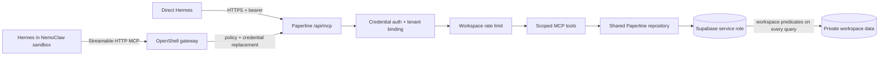

# Paperline remote MCP integration

Status: **Implemented and verified in the isolated candidate / production publication not approved**
Last reviewed: 2026-07-20
Endpoint shape: `https://<approved-paperline-host>/api/mcp`

This document describes Paperline's shared agent boundary for direct Hermes clients and NemoClaw/OpenShell-managed Hermes sandboxes. It is implementation and operator guidance, not a claim that the current public deployment contains this code.

## Current implementation boundary

Paperline implements a stateless, authenticated Streamable HTTP MCP endpoint using `@modelcontextprotocol/sdk` 1.29.0 and Web Standard `Request`/`Response` APIs.

Implemented locally:

- HTTPS-ready Streamable HTTP endpoint at `/api/mcp`
- stateless JSON responses; no in-memory cross-request session dependency
- high-entropy bearer credentials stored only as SHA-256 digests
- one user + one workspace binding per credential
- current membership, workspace plan, expiry, revocation, and scope checks on every request
- MCP/API access included on Free, Pro, Team, and Enterprise plans
- 128 KiB request cap, exact JSON content type, JSON-RPC validation, batch rejection, host allowlist, and browser-origin rejection
- database-backed per-workspace request limiting through migration `0012`
- four read-only MCP tools backed by workspace-filtered service-role queries
- bounded tool output classified as untrusted workspace data
- per-tool audit metadata without document content, prompts, or credentials
- protected dependency readiness route at `/api/readiness`

Not yet implemented or verified:

- OAuth 2.1 authorization-server flow
- production deployment of the MCP route
- NemoClaw/OpenShell managed-MCP verification
- Nous catalog review or inclusion
- mutating extraction/workflow tools or human-approval execution

## Shared architecture



The service-role client bypasses RLS. Therefore the credential-derived `workspaceId`—never a tool argument—is applied to every document, chunk, and template query. RLS remains defense in depth after migration `0011` is applied.

## Credential model

Migration `0013_agent_credentials.sql` extends the existing `api_keys` foundation with:

- `scopes text[]`
- `expires_at timestamptz`
- unique digest index
- constrained scope vocabulary

New agent credentials:

- use the `pl_mcp_` prefix plus 32 random bytes encoded as base64url
- are displayed once
- expire after 30 days
- default to `documents:read` and `templates:read`
- are rejected after revocation, expiry, membership removal, workspace deletion/ineligibility, missing scopes, or unknown scopes

Existing `pl_test_` keys receive no scopes/expiry and cannot authenticate to MCP. Administrators must rotate them after migration `0013` is applied.

A bearer credential is authentication material. Never place it in a URL, query string, screenshot, shell history, repository file, document, prompt, or chat message.

## Implemented tool contract

| Tool | Required scope | Mutation | Maximum output | Notes |
| --- | --- | --- | --- | --- |
| `paperline_list_documents` | `documents:read` | No | 50 records | Metadata only; no storage path or extracted text. |
| `paperline_get_document_summary` | `documents:read` | No | One record | Workspace-filtered; foreign/missing IDs return the same stable error. |
| `paperline_get_citations` | `documents:read` | No | 50 snippets, 500 chars each | Ready documents only; text is explicitly untrusted. |
| `paperline_list_templates` | `templates:read` | No | 50 records | Built-in and credential-workspace templates only. |

No current MCP tool exposes raw files, raw storage URLs, full document text, arbitrary SQL, arbitrary URLs, shell execution, model sampling, billing mutation, outbound email, workflow execution, or spend.

Hermes prefixes these names with the server name at runtime, for example `mcp_paperline_paperline_list_documents`.

## Direct Hermes configuration

Verify commands against the current [Hermes MCP documentation](https://hermes-agent.nousresearch.com/docs/user-guide/features/mcp) before use.

1. A Paperline workspace owner or admin creates an agent credential. MCP/API access is included on Free and paid plans.
2. Store the secret in `~/.hermes/.env`, not directly in `config.yaml`:

   ```dotenv
   PAPERLINE_MCP_TOKEN=<one-time Paperline credential>
   ```

3. Add this reviewed entry to `~/.hermes/config.yaml`:

   ```yaml
   mcp_servers:
     paperline:
       url: "https://<approved-paperline-host>/api/mcp"
       headers:
         Authorization: "Bearer ${PAPERLINE_MCP_TOKEN}"
       connect_timeout: 30
       timeout: 60
       supports_parallel_tool_calls: false
       tools:
         include:
           - paperline_list_documents
           - paperline_get_document_summary
           - paperline_get_citations
           - paperline_list_templates
         resources: false
         prompts: false
       sampling:
         enabled: false
   ```

4. From a fresh terminal, run:

   ```bash
   hermes mcp test paperline
   hermes mcp configure paperline
   ```

5. Start Hermes or use `/reload-mcp` after a reviewed configuration change.
6. Verify tool discovery, an authorized synthetic document lookup, and a citation lookup.
7. Revoke the Paperline credential and verify the next call fails with authentication error.

Do not enable parallel calls until every exposed tool and shared database path has passed concurrency review. Keep MCP sampling disabled: Paperline does not request inference from the Hermes client.

## Bring your own LLM boundary

Paperline MCP behaves like a high-end document skill for an agent harness:

- the client or harness selects and pays for its own model
- Paperline does not require a particular client-side LLM
- Paperline authenticates the workspace and returns bounded document metadata, citations, and templates
- Paperline's internal upload, OCR, embedding, extraction, and cited-chat features still use the AI provider configured for the Paperline deployment

This means a Free user can connect a preferred compatible harness without Paperline reselling the harness model. Normal Paperline page, provider, abuse, and request limits still apply.

## NemoClaw/OpenShell-managed Hermes configuration

Current NVIDIA documentation provides a dedicated NemoClaw for Hermes path. Re-check these pages and stable versions before any approved sandbox mutation:

- [NemoClaw for Hermes architecture](https://docs.nvidia.com/nemoclaw/user-guide/hermes/about/how-it-works)
- [About managed MCP servers](https://docs.nvidia.com/nemoclaw/user-guide/hermes/manage-sandboxes/mcp-servers/about-managed-mcp-servers)
- [Add an MCP server](https://docs.nvidia.com/nemoclaw/user-guide/hermes/manage-sandboxes/mcp-servers/add-an-mcp-server)

Approved workflow shape:

```bash
export PAPERLINE_MCP_TOKEN=<load-from-approved-secret-source>
nemoclaw <sandbox> mcp add paperline \
  --url https://<approved-paperline-host>/api/mcp \
  --env PAPERLINE_MCP_TOKEN
unset PAPERLINE_MCP_TOKEN
```

Operational requirements:

- use a normal public HTTPS DNS endpoint with a canonical literal path and no query, fragment, userinfo, or credential material
- let OpenShell store the credential outside the sandbox and resolve its placeholder at egress
- do not write the raw token under `/sandbox/.hermes`
- keep a distinct environment-variable name per managed MCP server
- inspect generated host, pinned IP, path, request-size, and MCP/JSON-RPC method policy before acceptance
- remember that OpenShell `tools/call` method policy currently permits every tool exposed by the server; Paperline's scope-filtered tool registration is the actual per-tool authorization boundary
- prove an unapproved host/method is denied
- prove the sandbox cannot read the raw credential
- rotate/revoke and retest

The current NVIDIA guide reported stable OpenShell `0.0.85` during this review. Treat that as dated evidence, not a permanent pin; verify current release notes and blueprint digest at execution time.

## Protocol and security behavior

- Production fails closed when `PAPERLINE_MCP_ALLOWED_HOSTS` is unset.
- Native MCP clients may omit `Origin`; any supplied browser `Origin` must be explicitly allowed.
- CORS is not used as authorization and no wildcard origin is emitted.
- Only `POST` is supported in the stateless first release.
- Batch JSON-RPC is rejected to prevent per-request quota and audit ambiguity.
- Unsupported protocol versions and malformed requests are handled by the official SDK.
- Authentication, database-schema, and limiter outages return bounded `401`, `429`, or `503` behavior.
- Tool output and citations remain data; they cannot authorize another tool, reveal credentials, or approve actions.

## Verification status

`pnpm test:mcp` currently proves:

- token format/hash behavior
- expiry, scope, membership, plan, and revocation-oriented authentication rules
- scope-filtered discovery through a real MCP SDK client
- workspace-bound repository calls and foreign-ID nondisclosure
- read-only annotations and untrusted-data envelopes
- HTTP initialize, `tools/list`, and `tools/call`
- missing auth, bad host/origin/content type, oversized body, batch request, malformed JSON, limiter failure, and `429` handling

The isolated candidate has migrations `0011`–`0013`, passed current native Hermes discovery and authorized read calls, rejected foreign document identifiers without disclosure, and rejected the next call after credential revocation. The reviewed Hermes entry above explicitly sets `supports_parallel_tool_calls: false`; current Hermes documentation defines that field as the client-side control for whether tools from an MCP server may execute concurrently. NemoClaw/OpenShell remains unverified, and the public production deployment still predates this implementation.

## Future versions

- Add standards-compatible OAuth 2.1 with authorization-server metadata, PKCE, refresh/revocation, and Hermes `auth: oauth` testing.
- Add `extractions:read` only after deterministic tenant tests.
- Add `extractions:write` only with idempotency, atomic claims, quotas, operation status, and a durable approval boundary where applicable.
- Treat Nous catalog submission as a separate source-review and public-publication decision requiring explicit approval.
