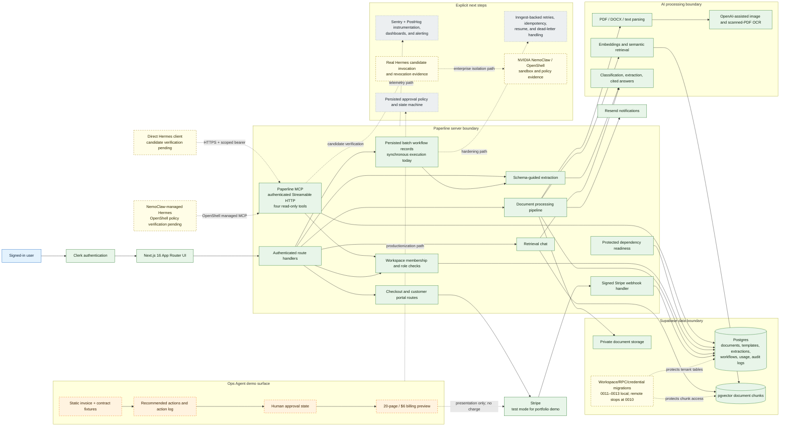

# Paperline architecture — portfolio view

> **Purpose:** Interview aid, not a production certification. This diagram separates code-backed capabilities from demo fixtures and planned hardening so reviewers can see both the working system and its boundaries.

## Status legend

- **Implemented locally:** executable repository path with deterministic local verification; it may still require candidate-runtime evidence.
- **Demo / simulated:** static sample data used to tell the Ops Agent story; it does not execute a real payment, approval, or external action.
- **Prepared / external verification required:** code or runbook exists, but the real external client/runtime test has not occurred.
- **Planned:** dependency or architecture direction without a wired production path in the current source.

## End-to-end data flow

1. A signed-in user uploads a supported file through an authenticated route.
2. The server checks workspace context, writes the private object to Supabase Storage, and creates a workspace-scoped document row.
3. The processing pipeline downloads the object, parses it, falls back to OCR for scanned PDFs/images, classifies it, chunks text by page, generates embeddings, and writes chunks plus document state.
4. Extraction applies a validated reusable schema. Chat retrieves workspace/document-scoped chunks and returns an answer with page and snippet citations.
5. Batch workflows persist workflow/item/extraction status, token usage, cost, and completion counts. They currently execute serially inside one request (`maxDuration = 300`), so **durable orchestration, retries, and resume semantics are planned rather than claimed**.
6. Billing routes create Stripe Checkout/Portal sessions. A signature-verified webhook synchronizes subscription plan and page limits. Portfolio screenshots and Ops Agent fixtures must say **Stripe test mode** and must not imply a real charge.
7. The local `/api/mcp` route authenticates scoped, expiring credentials and exposes four bounded read-only tools through the official MCP SDK. Direct Hermes and NemoClaw/OpenShell remain **Prepared / external verification required** until an approved candidate passes real-client, policy, credential-isolation, denied-call, and revocation tests.

## Trust boundaries and controls

- **Identity:** Clerk establishes the signed-in user.
- **Authorization:** route handlers resolve a workspace membership and check role where needed; database migrations add workspace-scoped RLS policies.
- **Privileged server access:** service-role Supabase access is server-side. Because it bypasses RLS, route-level workspace filters and ownership checks remain a critical control to review and test.
- **Evidence:** document chunks retain page numbers; chat citations include chunk/page/snippet references. The Ops Agent screenshot uses sample quoted evidence, not a live extraction run.
- **Billing:** Checkout/Portal endpoints require an authenticated workspace; Checkout additionally requires an owner/admin role. Stripe webhook events are signature verified before subscription state changes.
- **Auditability:** processing and workflow completion write audit rows; this is a useful foundation, not a claim of complete end-to-end compliance logging.
- **Compliance:** the project makes no HIPAA, SOC 2, or legal certification claim.
- **Agent boundary:** the MCP credential supplies identity and workspace server-side; document/template text is untrusted data. No model argument can select a workspace or authorize a new capability.
- **Release state:** migrations 0011–0013 are repository-backed but not applied remotely; the release checklist remains NO-GO until they are applied and negative-tested in an approved candidate.

## Repository evidence map

- Pipeline: `src/lib/pipeline/index.ts`
- Parsing/OCR/chunking: `src/lib/parsing/`, `src/lib/ai/ocr.ts`
- Extraction and cited chat: `src/lib/ai/extract.ts`, `src/lib/ai/chat.ts`
- Batch workflow execution: `src/app/api/workflows/route.ts`
- Auth/workspace boundary: `src/lib/auth/workspace.ts`
- Billing and provisioning: `src/app/api/billing/checkout/route.ts`, `src/app/api/billing/portal/route.ts`, `src/app/api/webhooks/stripe/route.ts`
- Tenant schema, RLS, limiter, and agent credentials: `supabase/migrations/0001_init.sql`, `supabase/migrations/0002_rls.sql`, `supabase/migrations/0011_security_hardening.sql`, `supabase/migrations/0012_workspace_rate_limits.sql`, `supabase/migrations/0013_agent_credentials.sql`
- Paperline MCP: `src/app/api/mcp/route.ts`, `src/lib/mcp/`, `scripts/validate-mcp.ts`
- Dependency readiness: `src/app/api/readiness/route.ts`, `src/lib/readiness.ts`
- Upload/file boundary: `src/lib/security/upload.ts`, `src/app/api/documents/upload/route.ts`
- Security regression gate: `scripts/validate-security.ts`
- Security/QA/release evidence: `docs/security/`, `docs/qa/`, `docs/release/`
- Demo-only Ops Agent data: `src/lib/ops-agent-demo.ts`
- Demo presentation: `src/app/(app)/ops-agent/page.tsx`
