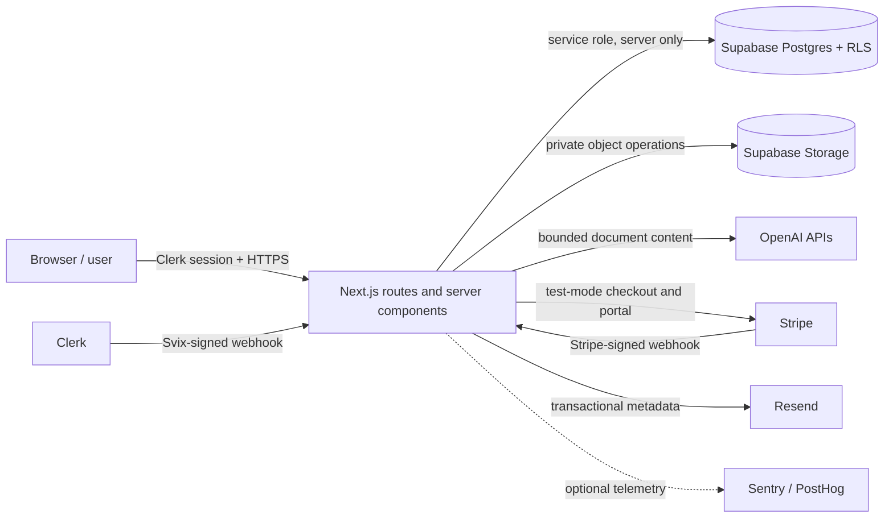

# Paperline threat model

## Scope and claims boundary

This model covers the current Next.js/Supabase/Clerk/OpenAI/Stripe design. It is an engineering threat model, not a penetration-test report or compliance certification. The static `/ops-agent` fixture is presentation-only and does not execute live Hermes, Stripe, or NVIDIA operations.

## Assets

1. Uploaded source documents and storage object paths.
2. Extracted text, OCR output, chunks, embeddings, citations, and structured results.
3. Workspace membership, roles, user IDs, and audit events.
4. API-key hashes/prefixes and one-time plaintext key responses.
5. Supabase service-role, Clerk, OpenAI, Stripe, Resend, and telemetry credentials.
6. Stripe customer/subscription IDs and plan/usage state.
7. Provider prompts, model output, exception data, and application logs.

## Trust boundaries and data flow

The highest-risk boundary is the Next.js server's service-role access: it bypasses RLS, so every route must authenticate, resolve membership, and constrain every object query by the active workspace. RLS remains defense in depth and protection for any future authenticated Supabase client.

## Threats and controls

| Threat | OWASP mapping | Current controls | Residual risk / next action |
| --- | --- | --- | --- |
| Guessed document/chat/template/workflow IDs (IDOR/BOLA) | API1:2023, A01 | Clerk proxy protection; `requireWorkspace`; workspace predicates on sensitive route queries; 404/403 negative behavior. | Execute two-workspace signed-in negative tests before launch. |
| Service-role confused deputy | API1, A01 | Server-only client; route-level workspace scoping; admin checks on billing/API keys. | Add reusable repository tests/mocks around route authorization as test architecture matures. |
| Cross-workspace relationship poisoning | A01, API1 | New 0011 migration validates both sides of tenant relationships. | Migration must be applied and tested in a disposable/production-like Supabase environment. |
| Malicious or mislabeled upload | A04, A08 | MIME allowlist, 25 MB limit, signature/content validation, sanitized filename/object path, private bucket. | Add decompression/page-complexity controls and sandboxed parsing for higher-risk public scale. |
| Parser/OCR resource exhaustion and denial of wallet | API4:2023, A04 | File cap, OCR page/attempt/concurrency caps, page plan checks, max workflow docs, question length. | Add atomic per-workspace reservations/rate limits and queue concurrency before unrestricted signup. |
| Prompt injection inside documents | LLM prompt-injection risk | Document text is supplied as data beneath system instructions; outputs are normalized; actions remain human-reviewed. | Add adversarial prompt-injection eval cases; never let document content authorize tools/spend. |
| Stored/reflected XSS | A03 | React escaping, structured JSON normalization, no raw HTML rendering in reviewed paths. | Add CSP report-only rollout and test user-supplied filenames/template fields in browser. |
| Webhook forgery/replay | API2/A07, A08 | Raw-body signature verification for Stripe and Clerk; provisioning and subscription updates are substantially idempotent. | Persist processed event IDs for durable replay suppression before scale. |
| Stripe workspace/plan tampering | API1/A04 | Admin-only checkout; fixed plan enum; customer↔workspace binding; signed webhooks; test keys by default. | Verify production dashboard metadata/webhook endpoints; live keys require explicit opt-in. |
| Secret or sensitive-log exposure | A02/A09 | ignored local env files, server-only credentials, generic public errors, no document excerpt logging, production health redaction. | Run history secret scan before push; configure telemetry scrubbing/retention. |
| Clickjacking/MIME/referrer/browser capability abuse | A05 | frame denial, nosniff, strict referrer, limited permissions policy, COOP. | Stage CSP; verify OAuth popup behavior and production headers after deployment. |
| Vulnerable dependencies/build chain | A06/A08 | lockfile, pinned Node/pnpm line, patched Next.js, production audit gate. | One transitive moderate PostCSS advisory remains; monitor upstream Next.js resolution. |
| Data retention/deletion failure | A04/privacy | private workspace model and cascade relationships. | Define retention, account deletion, object cleanup, backup restore, and legal-hold behavior before public launch. |

## Abuse cases to keep in regression testing

- Signed-out request to every private API.
- Member of workspace A requests or mutates an object from workspace B.
- Member submits workspace B's folder/document/template UUID in a valid body.
- PDF MIME with HTML/ZIP bytes; generic ZIP declared as DOCX; binary bytes declared as text.
- Oversized file, malformed PDF, empty OCR result, and repeated processing request.
- Document instructs the model to ignore system rules, reveal secrets, or approve spend.
- Stripe event carries an unknown plan or a customer that does not match workspace metadata.
- Invalid/replayed Clerk and Stripe signatures.
- API errors contain provider messages, SQL details, document text, or environment names.

## Production trust decisions

- Private documents must never be placed in public storage buckets.
- Service-role credentials remain server-only and are never a substitute for authorization.
- AI output is advisory/data extraction, not an authorization mechanism.
- No spend, provisioning, email, or external action occurs solely because a document or model requested it.
- Formal compliance claims require independent controls, evidence, contracts, and review beyond this repository.
